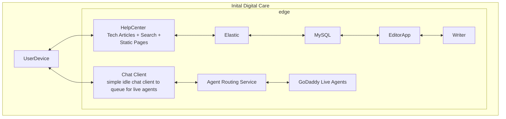
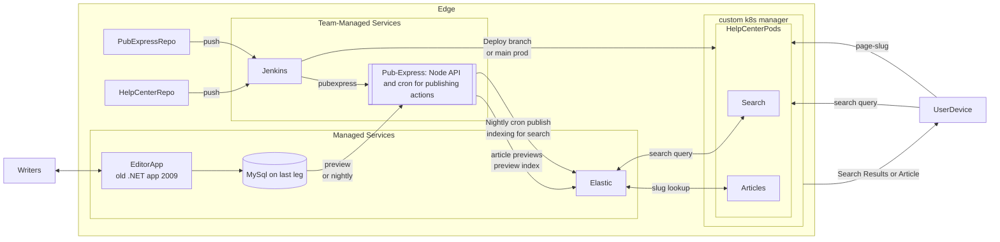
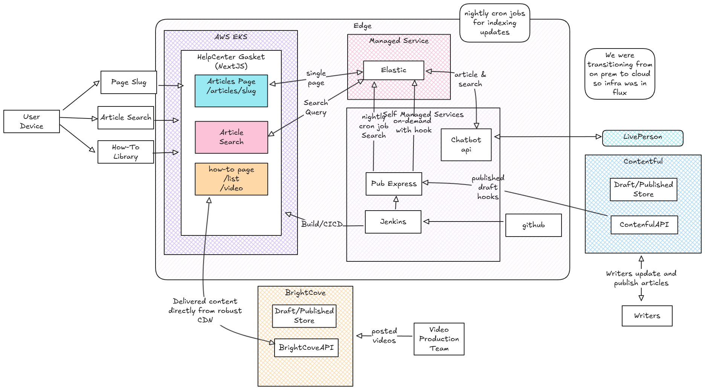
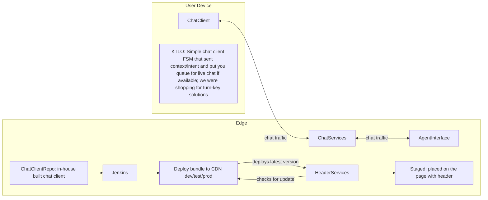
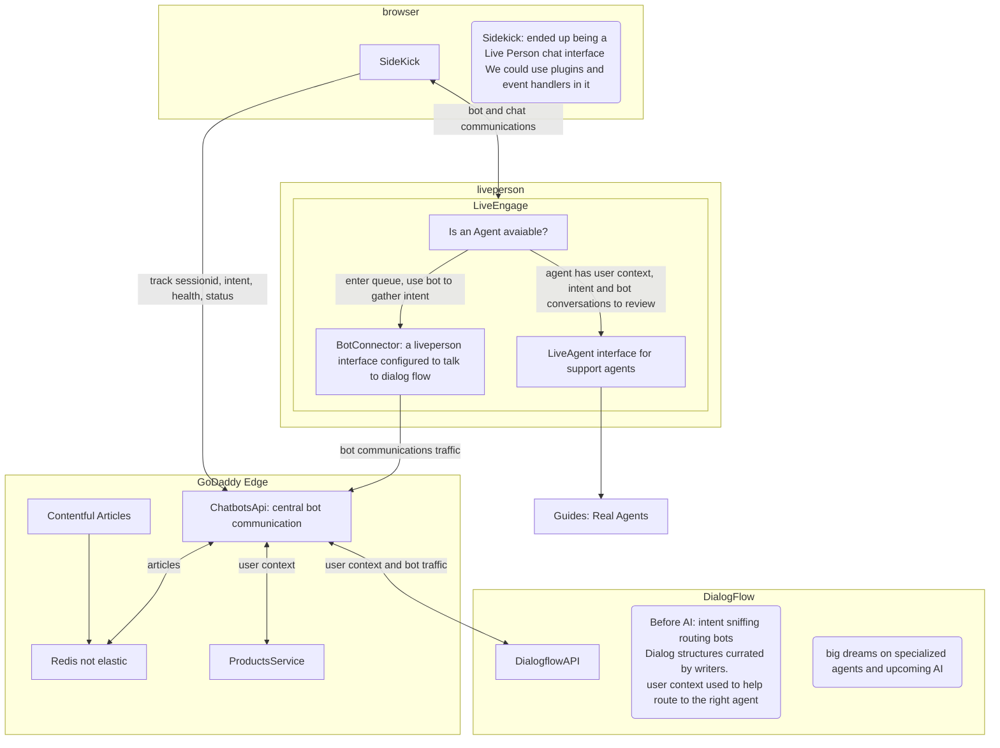
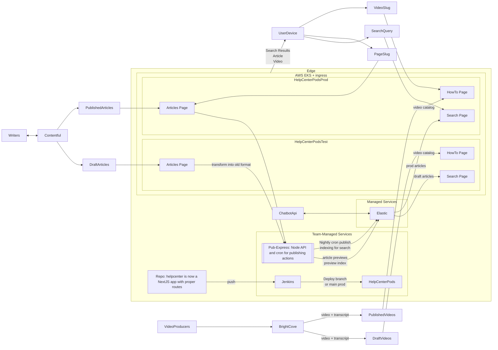

# Digital Care

After I shipped a react-navite based GoDaddy mobile app (discontinued) and was "done with mobile"
there was an openning for a new manager in Digital Care. 

I inherited the Digitcal Care apps services and and team(s). These team consisted of two very junior teams, I was able to fill in a couple senior roles though. I was intrumental in proposing and providing guidance and the encouragement to improve our systems. which touched many aspects of GoDaddy given all the pages used the chat client and all products have technical articles. 

The task was to modernize Help Center stack with React and NextJS, on-board LivePerson and level up our messaging support with more engaging experience and better chat bots and then replace the old 2008 in-house built MySQL backed article DB with a headless CMS

I also was mobbing with my team to convert all the pages from Jade to React, onboard Gasket (NextJS) for how-to videos which allowed us to move the rest of the site over to NextJS. I was a very hands-on manager with a pair station and would work coding with my team as much as possible. I hired my replacement manager and dropped to an IC during this time period to travel in our RV.   

I included what I started with and what we ended with.  

### The Start: Digital Care High Level

### Digital Care: The Initial Helpcenter

## Digital Care: Helpcenter we created with Contentful and Gasket (NextJS)

[Help Center Excalidraw](https://excalidraw.com/#json=Ba7auB9vcfzKoSrdLz4s9,8XOz6-10OuGOEtTTAP1Igw)

I broke mermaid...

## Digital Care: Initial Chat Client

## Digital Care: Bot Agents with Sidekick

### I was taking shortcuts due to mermaid, so I drew it out.

