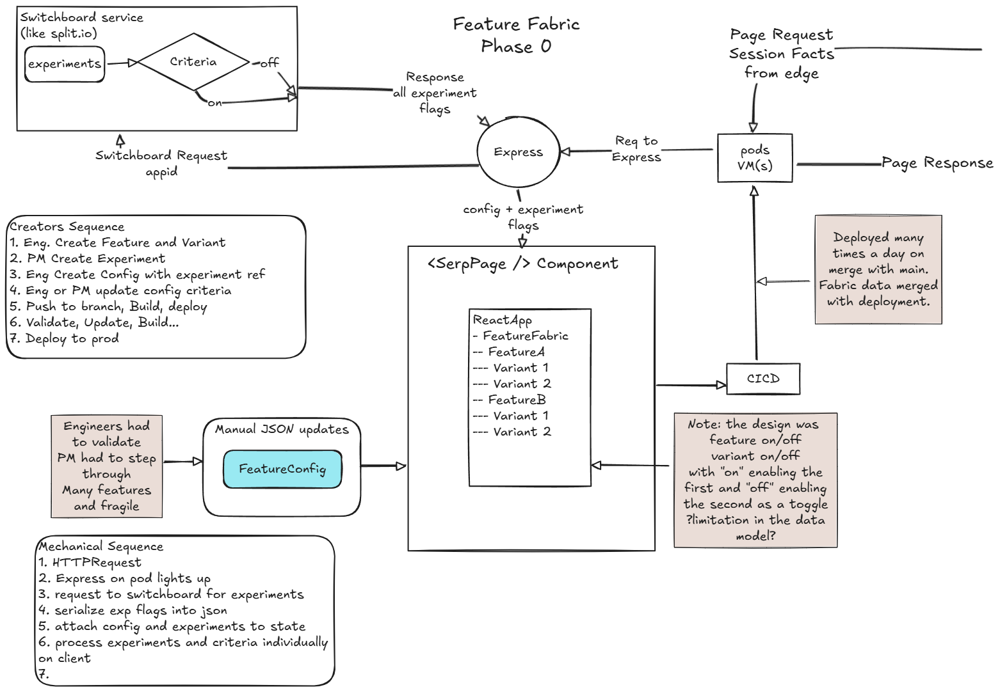
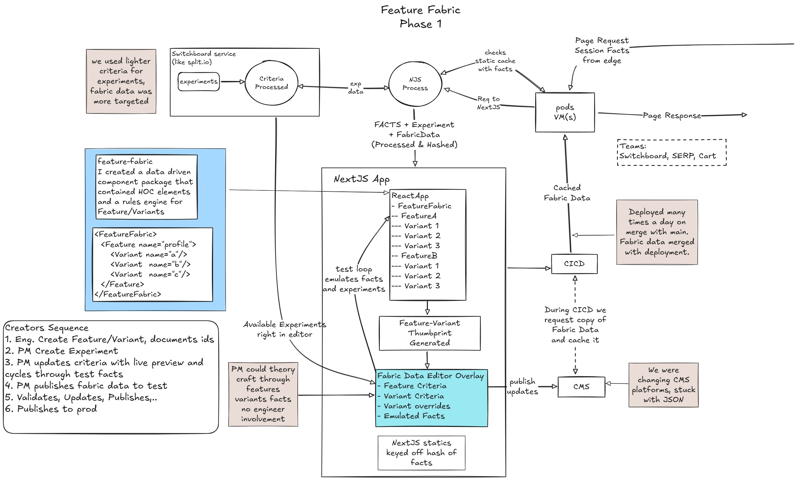
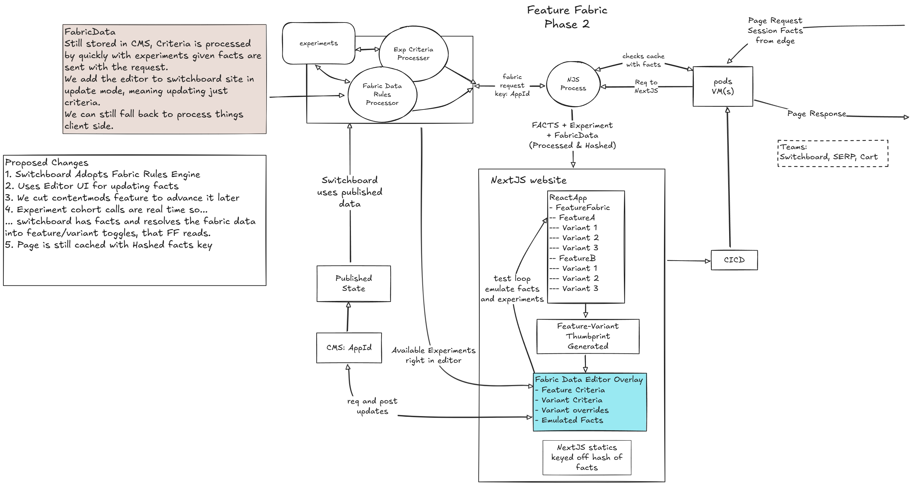
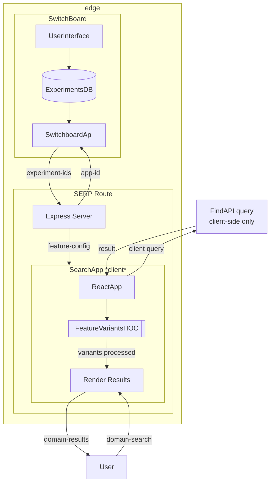
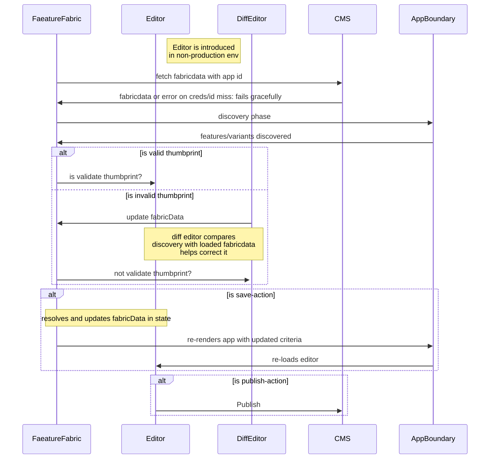
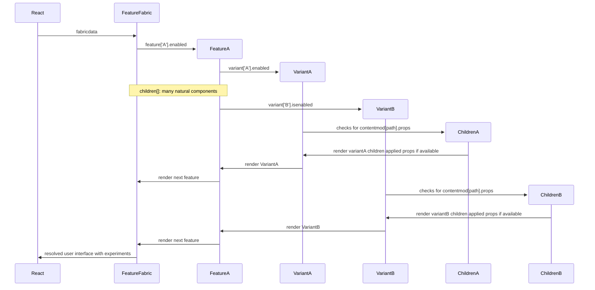
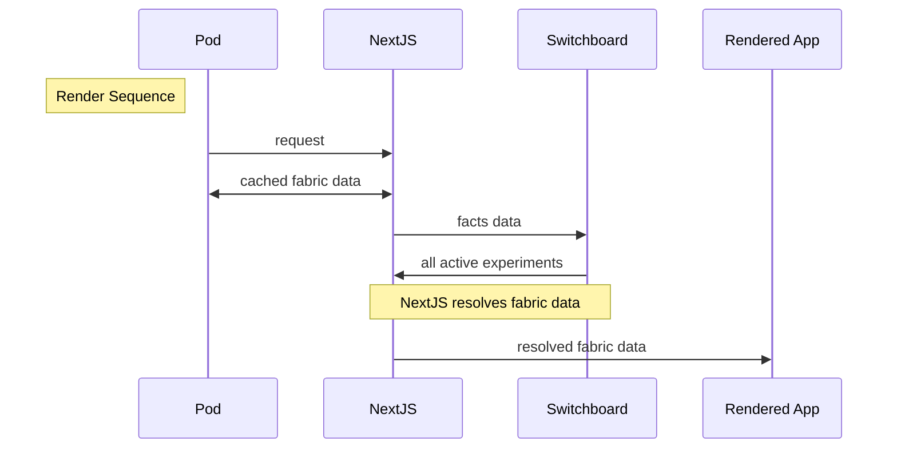
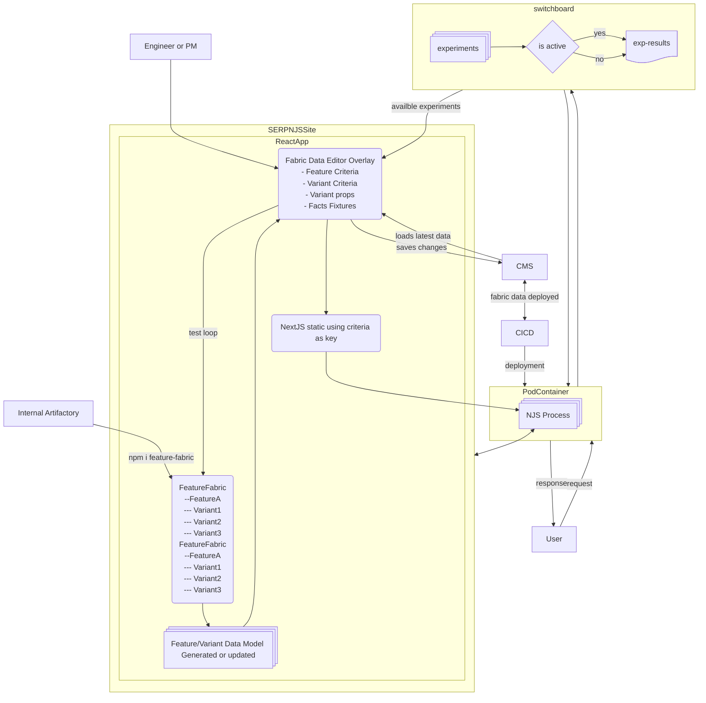

## Feature Fabric

> I was going to originally talk through this project, but, most of the moving parts are in the application layer and the service parts seem trivial? We can poke at through some of this if interested.

> This had a huge impact with the tech boucing up to the CTO teams(s) because it was making the abilty for non-engineers to easily explore, create and run experiments .. and provided a mechanism to share and use experiment criteria across apps/teams.

This is an experimentation accelerator that I happened to help build and promote as an IC on the SERP team. When I joined the SERP team the team was very new to React and JavaScript/TypeScript. 

As I was helping them and the codebase level up, I saw they had a FeatureVariant model and a bunch of tedious json configuration they did by hand. I worked with the Director, Experimentation Team, Cart team, and multiple PMs to create a drop-in page solution for any team using React for in-page feature/content experiments that would accelerate our ability to create and share experiments successes and failures.

### Phase 0: Initial state

### Phase 1: MVP+ Implementation

### Phase 2: Integrated with Experiment service

## SERP: (Search Results Page): No Feature Fabric: Phase 0

## Sequence Chart

