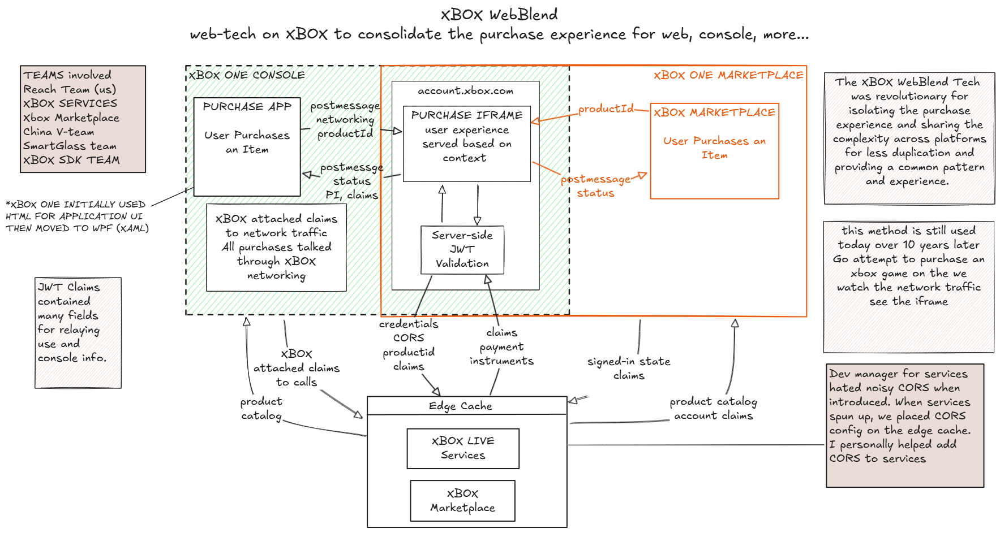

# Bonus: XBOX Purchase WebBlend

I started to write this up but the sequence diagrams for the xbox token challenges were crazy and some details are fuzzy as if it was 12? or so years ago. Here you go. It was fun to be instrumental in building this across about 4 - 5 teams to coordinate this endeavor and it's fun to talk about. It's crazy how everyhing comes together for a console in the last 3 months before shipping. 

[original excalidraw](https://excalidraw.com/#json=9TG-yAcPI3oK2Qq-KGkVq,S9K9Oq7WAFYP95iZVNgkbA)

WebBlend was built into the GDK. Searching "webblend" “xbox” will show some docs. 
They still use this method today, if you goto xbox.com and purchase a game. With devtools you can see the iframe and network tools the request to the microsoft store site. (which was the last team I was on at MS)

> more info if interested ...

The JWT claims… so many..
https://learn.microsoft.com/en-us/gaming/gdk/_content/gc/live/features/s2s-auth-calls/service-authentication/security-tokens/live-token-claims

GDK stuff
https://learn.microsoft.com/en-us/gaming/gdk/_content/gc/live/test-release/tools/live-xbox-common-events-tool
